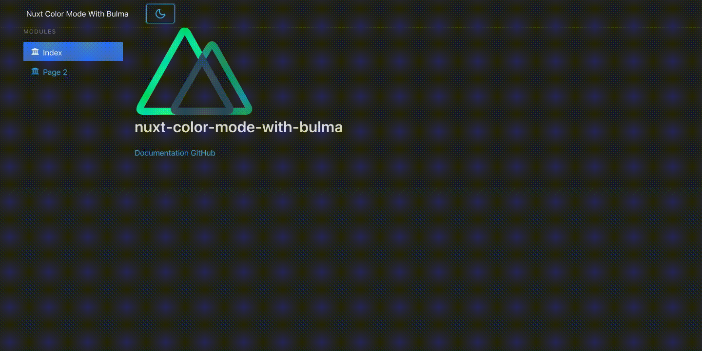
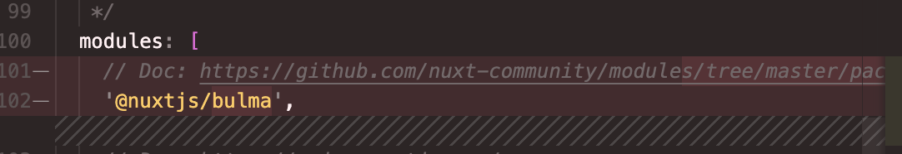
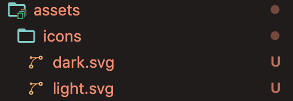

# Nuxt Color Mode with Bulma

# Introduction
[@nuxtjs/color-mode](https://color-mode.nuxtjs.org/) is a Nuxt.js module that will help us implement a Dark Mode toggle on our Nuxt.js apps much easier.

These are one of the ways on how you can leverage [@nuxtjs/color-mode](https://color-mode.nuxtjs.org/) if you're using Bulma.

When using a CSS Framework such as Bulma, we need to override Bulma's `.scss` variables as stated in this guide. 



<a name="RAwHh"></a>
# Setup
<a name="DTWao"></a>
## Installing dependencies
Install `node-sass` and `sass-loader` if you haven't yet, so we can use our `.scss` files properly.<br />(in `devDependencies` only because we won't need in during runtime, only during compilation)
```shell
npm i -D node-sass sass-loader
```

<br />Install [`@nuxtjs/color-mode`](https://github.com/nuxt-community/color-mode-module) that will take care of the toggling for us:<br />(in `devDependencies` as well for the same reason)
```shell
npm i -D @nuxtjs/color-mode
```

<br />**Install:**

1. `@nuxtjs/style-resources` - so we can use our `.scss` files globally in Nuxt. Share variables, mixins, functions across all style files (no `@import` needed)
1. Bulma - so we can import, use and override Bulma `scss` variables in our customized `.scss` files
1. `nuxt-svg-loader` - So we can load SVG icons and use as Vue components, for the toggle switch of Dark mode using SVG icon later
```shell
npm i @nuxtjs/style-resources bulma nuxt-svg-loader
```


<a name="lxMEc"></a>
## nuxt.config.js
Remove `@nuxtjs/bulma` if you haven't yet. Moving forward we will use Bulma .scss that we `npm install`-ed earlier.<br /><br />
<br />Include these on your `modules[]`:
```shell
modules: [
    // Doc: https://github.com/nuxt-community/style-resources-module/
    // Used with styleResources{}
    '@nuxtjs/style-resources',
    // Doc: https://github.com/Developmint/nuxt-svg-loader
    // So we can load SVG icons as Vue components
    'nuxt-svg-loader'
]
```

<br />Include `@nuxtjs/color-mode` on your `buildModules[]`:
```shell
buildModules: [
    // Doc: https://color-mode.nuxtjs.org/
    '@nuxtjs/color-mode'
]
```

<br />Add this on your `css[]`, and also add the new `styleResources{}` like so:<br />We'll setup our `assets/scss/main.scss` file later on below.
```javascript
  /*
   ** Global CSS
   */
  css: ['~assets/scss/main.scss'],
  /*
   ** So we can use our .scss file globally in the Nuxt app
   */
  styleResources: {
    scss: ['~assets/scss/main.scss']
  }
```


<a name="nxviJ"></a>
# Adding light and dark icons for the toggle switch
Create an `icons` directory inside `assets` like so, and add the `.svg` icons.<br />You can download the icons here: [https://github.com/nuxt-community/color-mode-module/tree/master/example/assets/icons](https://github.com/nuxt-community/color-mode-module/tree/master/example/assets/icons)<br /><br />

<a name="e4DQn"></a>
# Configuring our `main.scss`
This should be the bread and butter of this guide, the `scss` files. This shall be the content of our `assets/scss/main.scss`:
```css
/* Theme style (colors & sizes) */
@import "~bulma/sass/utilities/initial-variables";
@import "theme-default";

/* Core Libs & Lib configs */
@import "~bulma";

/* Mixins */
@import "mixins";

/* Theme components */
@import "nav-bar";
@import "title-bar";
@import "hero-bar";
@import "card";
@import "table";
@import "tiles";
@import "form";
@import "main-section";
@import "modal";
@import "progress";
@import "footer";
@import "misc";

/* For our dark mode scss implementation */
@import "dark-mode";
```
So what we've done here is:

1. Import `bulma/sass/utilities/initial-variables` first,
1. then override some Bulma variables in our custom `theme-default.scss` settings that will help us configure our dark mode colors and light mode base colors / CSS components
1. Import the rest of Bulma using `~bulma`
1. Override some components like the Navbar, and so on
1. Lastly, our dark mode implementation of the Bulma components when it is toggled on

<br />Next is to put the other supporting .scss files. You can get it here: [https://github.com/kensixx/nuxt-color-mode-with-bulma/tree/main/assets/scss](https://github.com/kensixx/nuxt-color-mode-with-bulma/tree/main/assets/scss)

<br />**I borrowed these .scss files on **[**admin-null-nuxt**](https://github.com/justboil/admin-null-nuxt)** Nuxt.js template (the free version one).**<br />
<br />So we're done with the `.scss` files! What we need next is the actual toggling action of dark and light mode.<br />

---

<a name="iBmpt"></a>
# Creating a Vue component that will serve as our light/dark toggle switch
create `components/ColorModePicker.vue`, and follow the code implementation below:
```vue
<template>
  <button class="button is-info is-block" @click="toggleDarkMode()">
    <ColorScheme placeholder="..." tag="span">
      <span v-if="$colorMode.value === 'dark'">
        <IconDark />
      </span>
      <span v-else>
        <IconLight />
      </span>
    </ColorScheme>
  </button>
</template>

<script>
import IconLight from '~/assets/icons/light.svg'
import IconDark from '~/assets/icons/dark.svg'

export default {
  components: {
    IconLight,
    IconDark
  },

  methods: {
    toggleDarkMode() {
      if (this.$colorMode.preference !== 'dark') {
        this.$colorMode.preference = 'dark'
      } else {
        this.$colorMode.preference = 'light'
      }
    }
  }
}
</script>

```
This is a simple Button component that will help toggle `@nuxtjs/color-mode` whether we want to use light or dark mode. You can change this one as you wish. 

`this.$colorMode.preference` is the one that will inject a `dark-mode` class in the whole `<html></html>` of the Nuxt project if it's set to `dark`.<br />
<br />It will then trigger the `dark-mode.scss` to change the Bulma components accordingly depending on what we set in the `dark-mode.scss` file.<br />

<a name="AS2AU"></a>
# Using the `ColorModePicker.vue` component
I think that's it! You can now include the `ColorModePicker.vue` component anywhere in your code, for me I've put it in the Navbar beside the Brand Logo like so:<br />!

```vue
<template>
  <nav class="navbar">
    <div class="container">
      <div class="navbar-brand">
        <nuxt-link class="navbar-item is-hoverable" to="/">
          Nuxt Color Mode With Bulma
        </nuxt-link>
        <button class="button navbar-burger">
          <span></span>
          <span></span>
          <span></span>
        </button>
        <div id="navbarBasicExample" class="navbar-menu">
          <div class="navbar-start">
            <a class="navbar-item">
              <ColorModePicker />
            </a>
          </div>
        </div>
      </div>
    </div>
  </nav>
</template>
```

<br />**Note: remember to import this component like so:**
```vue
<script>
import ColorModePicker from '~/components/ColorModePicker'

export default {
  components: {
    ColorModePicker
  }
}
</script>
```

